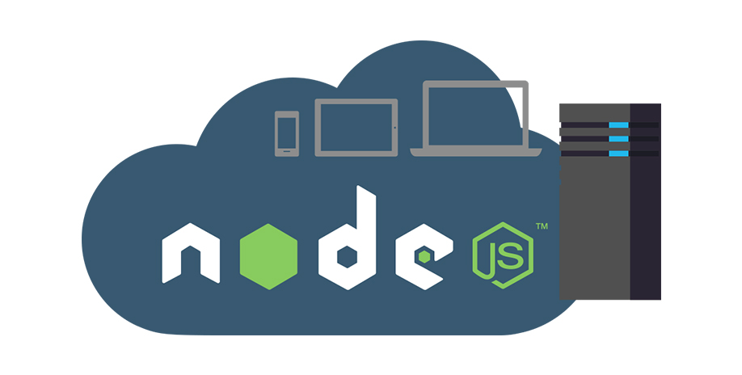

## NodeJS 后端编程入门教学 (NodeJS Tutorials For Beginners)

欢迎点击以下链观看NodeJS入门教学! 

如果在学习中遇到难题，可以去到[Codetisan自学编程社区](https://bit.ly/2AHylzN)和其他同学一起讨论，相互支持，大家一起成长！

| Episode | Content |
| ------ | ------ |
| Episode01 第一集 | [保证零基础初学者也能轻松入门NodeJS后端编程！自学编程就从这个NodeJS教学开始！NodeJS Tutorial For Beginners: Hello World](https://youtu.be/PQoK7r4MJoQ) |
| Episode02 第二集 | [10分钟快速编写属于自己的Node JS后端服务器 - 迈入全端开发的第一步 (Build NodeJS Backend Server Under 10mins)](https://youtu.be/zHB1dn8FU44) |
| Episode03 第三集 | [NodeJS后端程序怎么知道用户浏览的页面？ (NodeJS GET请求 入门教学) How to handle GET requests in NodeJS server](https://youtu.be/gOPS_1jgaR4)
| Episode04 第四集 | [NodeJS是怎么处理客户端发过来的GET请求参数 (node js获取http get参数) | NodeJS: How To Parse GET Query String](https://youtu.be/7e1wQDBxxek)
